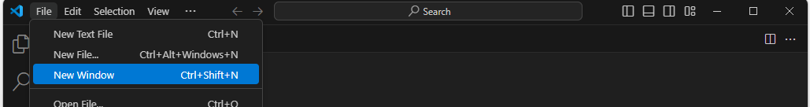

# 중고 물품 매물 검색 및 비교

## 목적

 코로나, 고물가 시기를 거치면서 중고 거래 이용자 수가 많이 증가했고 다양한 중고 거래 앱이 생겨났다. 절판 된 상품을 구하고 싶거나 좀 더 저렴한 가격 물건을 구하고 싶을 때 한 번쯤 중고 거래를 고려해보게 되는데 다양한 플랫폼들에 올라온 상품 정보를 한꺼번에 모아서 검색, 비교할 수 있으면 편리할 것 같다고 생각했다.


## 기능

1. 당근마켓, 중고나라, 번개장터 플랫폼에 동시에 검색
2. 당근마켓 매물 6개, 중고나라/번개장터 매물 10개 출력
3. 기본 정렬, 낮은금액순 정렬, 높은금액순 정렬
4. 카카오톡 나에게 보내기
    - 로그인
    - 각 플랫폼 연결 url 전송
5. 엑셀로 저장하기
    - 검색된 모든 매물(총 26개)의 정보가 담긴 엑셀 파일 저장


## 개발자

- 기획자 : 임사랑
- 발표자 : 강승진 
- 개발자 : 강지윤, 박세웅 


## 프로젝트 실행 방법 (local)

1. VSCode - New Window
    
    
    
2. Clone Git Repository 클릭
    
    
    
3. Repository url 입력
    
    ```
    https://github.com/LaliMa-KJY/RPA-Project.git
    ```
    
4. 아래 파일 생성
    
    
    
    > 파일 내용은 따로 드립니다.
    > 
5. Terminal 새로 열고 아래 명령 입력
    
    
    
    ```bash
    python manage.py runserver
    ```
    
6. 127.0.0.1:8000 접속
